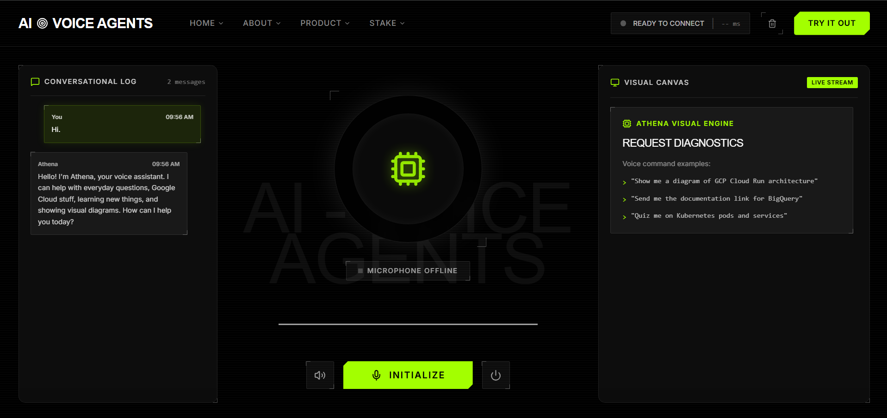
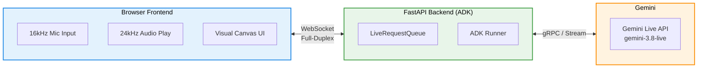

<div align="center">
  

  <h1>⚡ Athena — Multimodal Live Voice Assistant ⚡</h1>
  <p>
    <b>An interactive, full-duplex Live Voice AI Assistant powered by the Gemini Multimodal Live API and Google ADK.</b>
  </p>

  <p>
    
    
    
    
    
  </p>
</div>

<br/>

Athena is not your standard text-chatbot or turn-based voice bot. She communicates through low-latency **bidirectional audio streaming**. You can speak to her naturally, talk over her mid-sentence (**barge-in interruption**), and see real-time visual diagrams and clickable resource link cards pop up on your screen while she talks.

---

## ✨ Key Features

- <kbd>🎙️ Full-Duplex Audio Streaming</kbd> Real-time `16kHz` microphone audio streaming up and `24kHz` synthesized voice audio (`Aoede`) streaming down.
- <kbd>⚡ Native Barge-in / Interruption</kbd> Interrupt Athena at any moment mid-sentence. Client and server detect speech instantly and cut off output audio buffers.
- <kbd>🖼️ Pictorial Diagrams & Visual Canvas</kbd> Renders flowcharts, architecture diagrams (Mermaid.js), and visual summary cards on screen when requested.
- <kbd>🔗 Clickable Link Sharing</kbd> Sends clean, clickable documentation links to the chat panel instead of reading out raw URLs.
- <kbd>☁️ Google Cloud Assistant</kbd> Real-time GCP technical documentation, pricing overview, and architecture guidance.
- <kbd>📚 Socratic Learning Tutor</kbd> Interactive learning module for quizzing, topic breakdowns, and concept reviews.
- <kbd>🎨 Modern Light-Theme UI</kbd> 3-column responsive layout built with Tailwind CSS, Lucide Icons, and an HTML5 Web Audio Visualizer.

---

## 🛠️ Architecture Overview

The system uses a highly optimized WebSocket bridge to stream data between the browser and the Gemini Live API.



---

## 📁 Project Structure

```bash
.
├── 📂 assets/              # Static assets (images, banners)
├── 📂 athena/              # Backend application
│   ├── 📄 __init__.py      # Package initialization
│   ├── 📄 agent.py         # ADK Agent definition & model configuration
│   ├── 📄 persona.py       # Athena system instructions & persona prompt
│   ├── 📄 tools.py         # Custom tool functions (GCP, Learning, Visuals, Links)
│   └── 📄 server.py        # FastAPI server & WebSocket live streaming bridge
│
├── 📂 frontend/            # Web frontend
│   ├── 📄 index.html       # Light-theme 3-column UI dashboard
│   ├── 📄 main.js          # Web Audio API, WebSocket client, barge-in logic
│   └── 📄 pcm-processor.js # AudioWorklet downsampling mic audio to 16kHz PCM
│
├── 📄 .env.example         # Environment variables template
├── 📄 .gitignore           # Protects .env and sensitive credentials
├── 📄 pyproject.toml       # Project dependencies & package configuration
└── 📄 README.md            # Documentation (You are here)
```

---

## 🚀 Quick Start

### 1️⃣ Prerequisites
- **Python** `>= 3.11`
- A **Google Gemini API Key** (from [Google AI Studio](https://aistudio.google.com/))

### 2️⃣ Installation
Clone the repository and navigate into the directory:
```bash
git clone https://github.com/YOUR_USERNAME/athena-live.git
cd athena-live
```
Install dependencies:
```bash
pip install fastapi "uvicorn[standard]" google-genai google-adk python-dotenv websockets
```

### 3️⃣ Environment Configuration
Copy `.env.example` to `.env`:
```bash
cp .env.example .env
```
Edit `.env` and paste your Gemini API key:
```env
GOOGLE_GENAI_USE_VERTEXAI=FALSE
GOOGLE_API_KEY=your_gemini_api_key_here
LIVE_MODEL=gemini-3.8-live
LIVE_VOICE=Aoede
OTEL_SDK_DISABLED=true
```

---

## 🖥️ Running the Application

### ✨ Option A: Custom FastAPI Server (Recommended)
Start the FastAPI server with Uvicorn:
```bash
uvicorn athena.server:app --port 8000
```
Open your browser at **[http://localhost:8000](http://localhost:8000)** and tap the microphone button to talk with Athena.

### 🛠️ Option B: ADK Web UI Preview
You can also run Athena inside Google ADK's built-in developer interface:
```bash
adk web . --port 8000
```

---
<div align="center">
  <p><i>Made with ❤️ for Voice AI</i></p>
</div>
